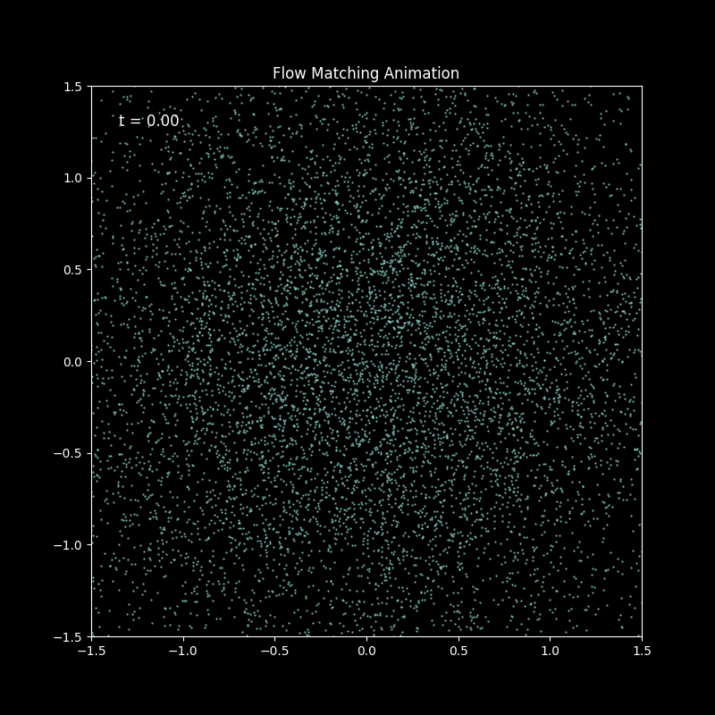

# Seminar on Scientific Machine Learning in Physics
### Likelihood based Generative Modeling: Variational Autoencoders and Normalizing Flows

Our Code for the Scientific Machine Learning for Physics Seminar.
You can find multiple notebooks that can be run in google colab. 

We note that some of these images shown on the HTML website in the report do not belong to us, references can be found in the pdf file of the report.

